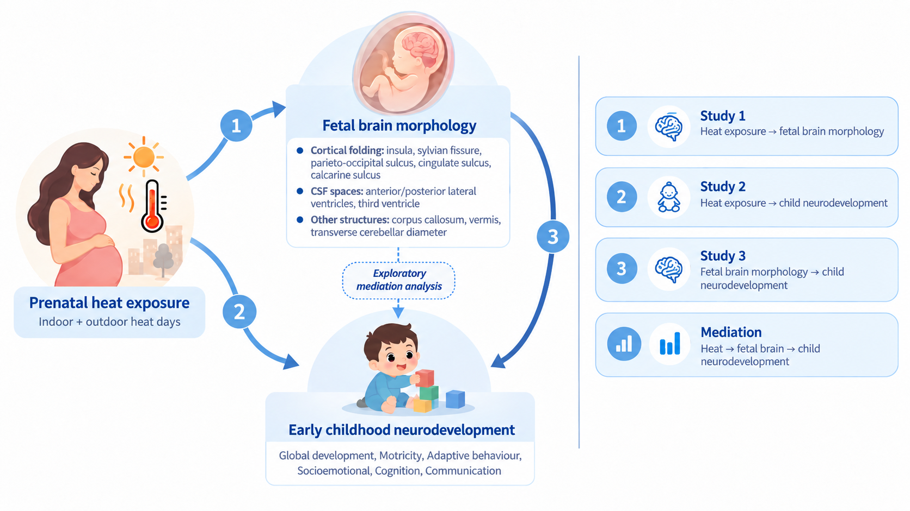

# Prenatal indoor and outdoor heat exposure, fetal brain morphology, and early childhood neurodevelopment

## Aim

This study aimed to investigate the associations among prenatal indoor and outdoor heat exposure, fetal brain morphology, and early childhood neurodevelopment.

## Graphical abstract

## Code overview

The R scripts are organized in the approximate order of the analysis workflow. The study data are not included in this repository.

| Script | Purpose |
| --- | --- |
| `01_prepare_data.R` | Loads outcome and covariate data; selects and renames variables; imputes missing values for important covariates; and creates the final analysis dataset. |
| `02_exposure_data.R` | Calculates daily heat index from temperature and humidity, identifies heat-exposure days using temperature and heat index thresholds, and counts the total number of heat-exposure days for each participant over the whole pregnancy and through the ultrasound date. Calculats the number of outdoor heatwaves during the whole pregnancy. |
| `03_GAM.R` | Fits generalized additive models to assess whether associations between prenatal heat exposure and study outcomes is linearity. |
| `04_function_LMM_csv.R` | Defines functions for mixed-effects regression analyses, extraction of coefficients, standard errors, confidence intervals and p-values, and export of results as CSV files. |
| `05_main_results.R` | Runs the main analyses for Substudies 1–3 and generates forest plots of effect estimates and 95% confidence intervals across exposures and substudies. |
| `06_0_sensitivity_results.R` | Runs the prespecified sensitivity analyses from the original manuscript. |
| `06_1_sensitivity_results.R` | Runs additional sensitivity analyses added in response to reviewer comments during the first revision. |
| `06_2_Monte_Carlo.R` | Assesses the potential impact of indoor-temperature prediction error. Each simulation resamples error sequence of warm-season out-of-sample residuals from long-term temporal validation, reconstructs cumulative heat-exposure days and refits the main models. |
| `07_Mediation.R` | Assesses whether fetal brain morphology mediates associations between prenatal heat exposure and neurodevelopmental outcomes. |
| `08_Extended.R` | Produces additional analyses, tables and figures presented in the Supplementary Information or Extended Data. |

## Codebook

An Excel codebook accompanies the scripts and describes the study variables and their coding: [Download the codebook](CODE_BOOK.xlsx).

## Data access

The study data are not publicly available because of privacy, ethical and data protection restrictions. BiSC provides gated access through a data request procedure: applicants submit the BiSC data request form for evaluation by the BiSC Steering Committee and, if approved, sign a formal Data Transfer Agreement (DTA) before data are shared. See the [BiSC data request information](https://projectebisc.org/en/bisc-project/publish-with-us/).
